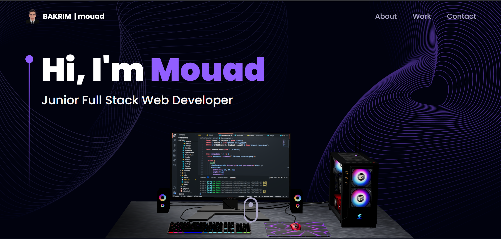

<!-- About the Project -->
## :star2: About the Project

<div align="center">
  
</div>

<br />

This repository houses an well-designed and functional Developer Portfolio Website consisting Navbar, Hero, Overview, Work Experience, Technologies, Projects, Testimonials and Contact sections built with React & Three.js using TailwindCSS ⏭

<!-- Folder Structure -->
### :bangbang: Folder Structure

Here is the folder structure of 3D-Portfolio.
```bash

<!-- Getting Started -->
## :toolbox: Getting Started

<!-- Installation -->
### :gear: Installation

#### Step 1:
Download or clone this repo by using the link below:

```bash
 https://github.com/ladunjexa/Threejs_3D_Portfolio.git
```

#### Step 2:

3D-Portfolio using NPM (Node Package Manager), therefore, make sure that Node.js is installed by execute the following command in console:

```bash
  node -v
```

#### Step 3:

At the main folder execute the following command in console to get the required dependencies:

```bash
  npm install --legacy-peer-deps
```

#### Step 4:

At the main folder execute the following command in console to creates a build directory with a production build of 3d portfolio:

```bash
  npm run build
```

#### Step 5:

At the main folder execute the following command in console to run the server:

```bash
  npm run start
```

<!-- Run Locally -->
### :running: Run Locally

#### Step 1:

At the main folder execute the following command in console to get the required dependencies:

```bash
  npm install --legacy-peer-deps
```

#### Step 2:

At the main folder execute the following command in console to run the development server:

```bash
  npm run dev
```
